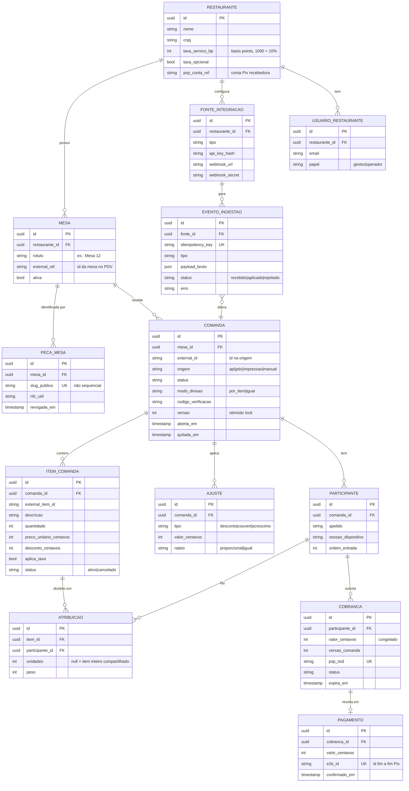
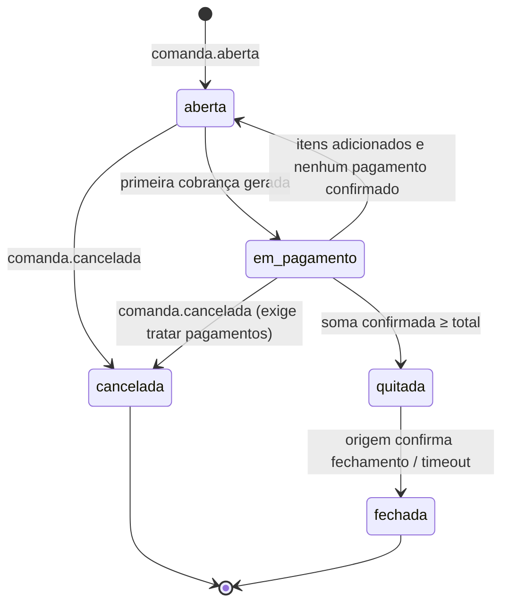
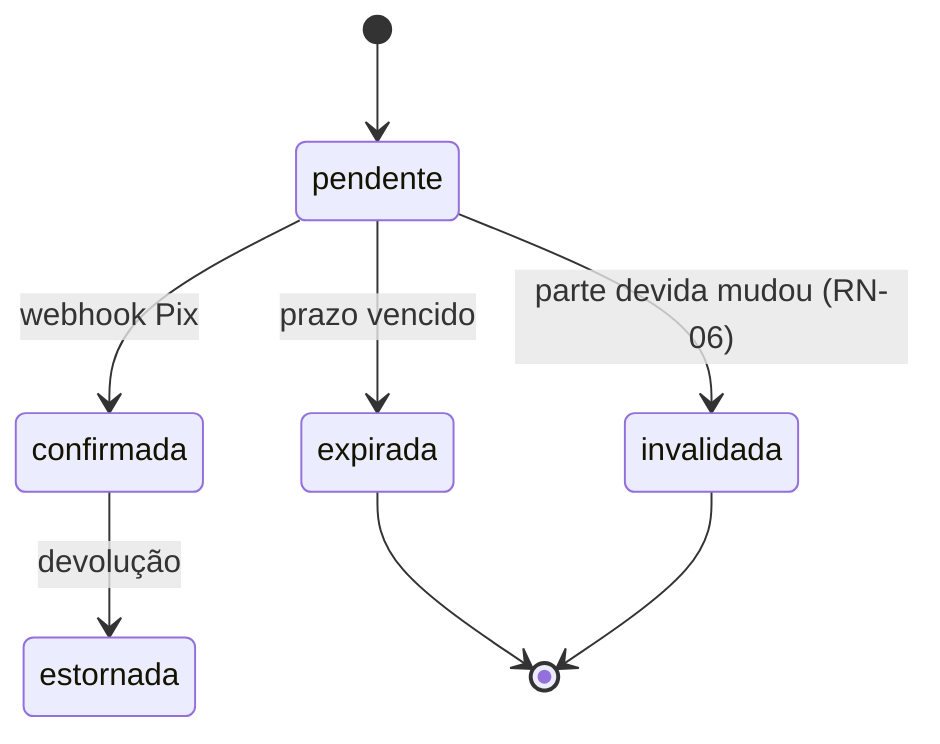

# 03 — Modelo de domínio

## Contextos delimitados

| Contexto | Responsabilidade | Entidades principais |
|---|---|---|
| **Ingestão** | Receber dados de fontes externas e traduzi-los para o formato canônico | FonteIntegracao, EventoIngestao |
| **Comanda** | Estado da conta da mesa (fonte da verdade dos itens) | Restaurante, Mesa, PecaMesa, Comanda, ItemComanda, Ajuste |
| **Divisão** | Quem assumiu o quê e quanto cada um deve | Participante, Atribuicao |
| **Pagamento** | Cobranças, confirmações e conciliação | Cobranca, Pagamento |
| **Identidade** | Operadores do restaurante e permissões | UsuarioRestaurante |

## Diagrama de entidades



## Máquina de estados — Comanda



`quitada` significa que todo o valor foi pago. `fechada` significa que a mesa foi liberada na origem (PDV ou operador). Os dois estados ficam separados porque a origem pode demorar a reconhecer a quitação.

## Máquina de estados — Cobrança



Um webhook de confirmação que chega para uma cobrança `invalidada` ou `expirada` **não é descartado**. O dinheiro entrou de fato, então o pagamento é registrado e o excedente segue a política da Q-05.

## Cálculo da divisão

O cálculo é uma **função pura**: recebe a comanda, as atribuições e as configurações, e devolve o valor devido por participante. Ele é sempre recalculado do zero, nunca de forma incremental, o que facilita testar e auditar.

```
para cada item ativo:
  valor_item = quantidade × preco_unitario − desconto
  se há atribuições por unidade:
     valor por unidade = valor_item / quantidade (resto pela RN-03)
  senão:
     divide valor_item pelos pesos dos participantes (resto pela RN-03)
subtotal[p] = soma das partes de p
taxa[p]     = subtotal_taxavel[p] × taxa_bp / 10000 (resto pela RN-03)
ajustes     = rateados conforme o campo rateio
devido[p]   = subtotal[p] + taxa[p] + ajustes[p] − pagos_confirmados[p]
nao_atribuido = total − soma(subtotal + taxa + ajustes)
```

**Invariante testável:** `soma(devido) + soma(pago) + nao_atribuido == total`, para qualquer entrada.
