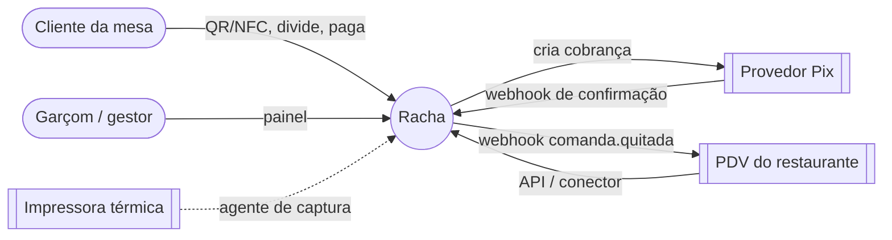
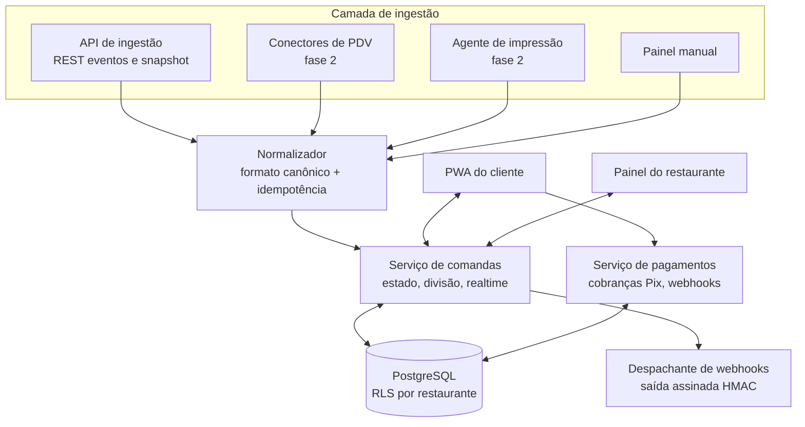

# 04 — Arquitetura

## Contexto (C4 nível 1)

## Containers (C4 nível 2)

## Decisões estruturantes

1. **Formato canônico único** ([ADR-0002](adr/0002-ingestao-com-formato-canonico.md)): nenhuma fonte grava direto no estado da comanda.
2. **Monólito modular no MVP** ([ADR-0003](adr/0003-monolito-modular-no-mvp.md)): os "microserviços" começam como módulos com fronteiras claras dentro de um mesmo deploy. Cada um é extraído quando houver motivo concreto, como escala, deploy independente ou um agente rodando no cliente. O agente de impressão já nasce separado por natureza, porque roda no computador do restaurante.
3. **Pix com recebimento direto na conta do restaurante** ([ADR-0004](adr/0004-pix-direto-ao-restaurante.md)): a plataforma não custodia dinheiro.
4. **Event log da comanda:** toda mudança vira um evento persistido. O estado atual é a projeção desses eventos, o que permite auditoria e reprocessamento quando um parser de fonte for corrigido.

## Tempo real

Os clientes da mesma comanda assinam um canal `comanda:{id}`. Qualquer mudança (item, atribuição, pagamento) publica o estado recalculado. A escrita usa otimistic lock pelo campo `versao`, para evitar que dois cliques simultâneos se sobrescrevam.

## Segurança

- **URL da mesa:** usa um `slug_publico` aleatório de 10 ou mais caracteres em base62. Se uma peça for perdida ou clonada, basta revogá-la, sem mexer na mesa.
- **Sessão do cliente:** um token anônimo amarrado ao participante e à comanda, que expira quando a comanda é fechada.
- **API de ingestão:** usa uma chave por fonte (guardada como hash) e rate limit por restaurante.
- **Webhooks recebidos:** a assinatura e o IP do provedor Pix são validados antes de processar.
- **Webhooks enviados:** levam o header `X-Racha-Signature` (HMAC-SHA256), com retentativa e backoff exponencial.
